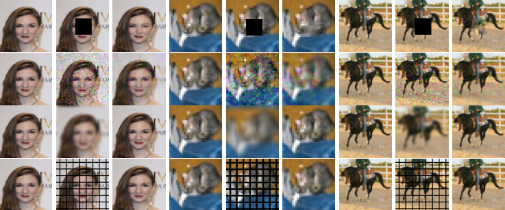

# ButterFlyNet2D
This is the repository for ButterFlyNet2D, which is a neural network that can be initialized as a 
Fourier Transform Operator or its inverse. If you are interested in this work, refer to 
<a href="https://arxiv.org/abs/2211.16578">[Paper]</a>. <br />

<p>

<center>



</center>

</p>

## Funcs
Here stored some supportive functions which will be used in the building-up, training or testing process.

Before the training process, we highly recommend you to run ` BaseInitGenerate.py ` in this folder like this:

```
python BaseInitGenerate.py <input size> <layer number> <cheb num> <initMethod> <pretrain>
```

You can determine what you want follow this:
```
input size: 32/64/128/256
layer number: any positive integer you want
cheb num: any positive integer you want
initMethod: Fourier/kaimingU/kaimingN/orthogonal
pretrain: True/False
```

This will do the initialization and save the parameters which can be reused in training.

## Nets

Core neural networks are stored here. `ButterFlyNet2D.py` and `ButterFlyNet2D_IDFT.py` are about the non-zero entries of Butterfly Algorithm; `ButterFlyNet2D_CNN.py` and `ButterFlyNet2D_CNN_IDFT` are about all the entries. The `*Flexible*` files are some trials about adding Pooling layers.

## Test
Mainly contain test parts. `Test.py` is implemented for testing, while other programs are for corresponding task's testing process. Test will be done during the training process. If you want to execute `Test.py`  only, run in this form:

```
python Test.py <task name> <dataset name> <image size> <local size> <net layer> <cheb num> <initMethod> <pretrain> <pic>
```

You can determine what you want follow this:
```
task name: Inpaint/Denoise/Deblur/Linewatermark
dataset name: Celeba/CIFAR10/STL10
image size: 32/64/128/256
local size: 16/32/64
net layer: any positive integer you want
cheb num: any positive integer you want
initMethod: Fourier/kaimingU/kaimingN/orthogonal
pretrain: True/False
pic: True/False
```

Here the option `<pic>` is for whether you want to save images.

## Train

Mainly contain training parts.

If you want to do the training tasks, adjust settings in `settings.json`:

```
{
    "datasetName": "Celeba",
    "task": "Inpaint",
    "epoches": 12,
    "batch_size_train": 20,
    "image_size": 64,
    "local_size": 64,
    "net_layer": 6,
    "cheb_num": 2,
    "initMethod": "Fourier",
    "pretrain" : true,
    "resume": false
}
```
the option `resume` is for resume.

Then run `train.py`:

```
python train.py
```

If you want to do the Fourier Transform Approximation part, do
```
python FTApprox.py <test type> <corresponding number> <inputSize> Fourier <net type> <train>
```
here `<test type>` could be `layer` or `cheb`, `<correspoding number>` then become fixed cheb num or layer num. `<net type>` is designed for whether it is DFT or IDFT operator, could be `f` or `b`. `<train>` is to test
the approximation power before or after training, simply choose from `True` or `False`. After training, the parameters will be stored.

## data
The networks will load data from here by default. CIFAR10 and STL10 dataset are used through PyTorch, and you need to fulfill the CelebaA dataset folder all by yourself.

## Pths & Images
These two folders are created for storing parameters and images.

## Acknowledgement
The author thanks <a href="https://github.com/YingzhouLi">Yingzhou Li</a>, the code is implemented with his great help.
